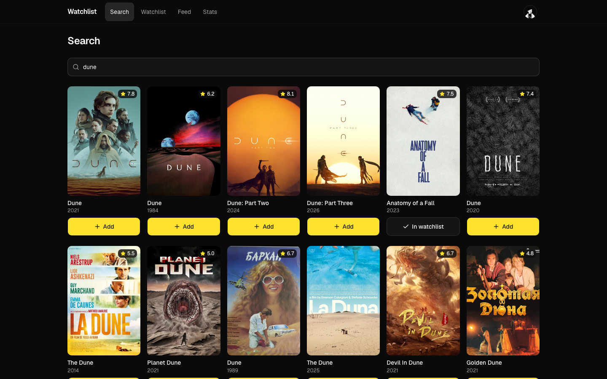
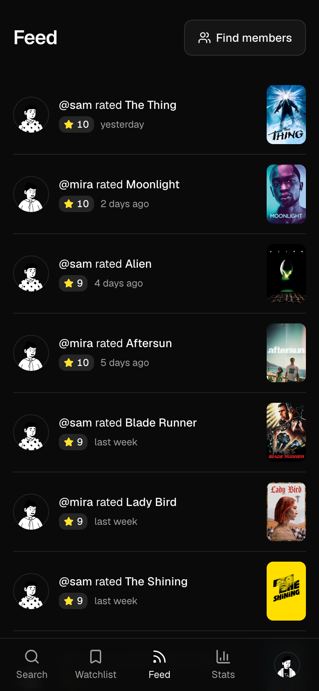
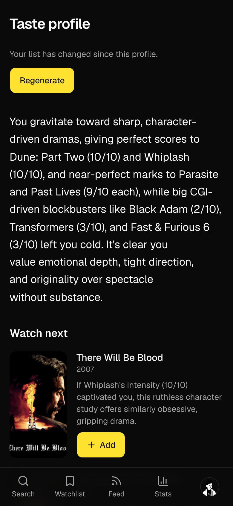
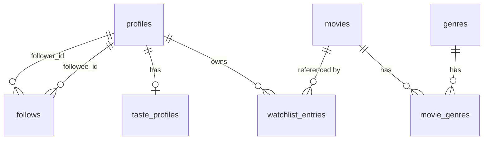

# Watchlist

A Letterboxd-style film tracker I built for the MAC Projects take-home.

Live: https://watchlist-ashen-ten.vercel.app

Demo login: `demo@example.com` / `watchlist-demo`. `sam@example.com` and `mira@example.com` use the same password. Demo follows both of them, so the feed, stats and taste profile already have something in them. You can also sign up with any email, since confirmation is off.



<p>
  
  
</p>

More phone and desktop captures are in [`docs/screenshots`](docs/screenshots).

## What it does

- Search TMDB and open a film's page with its backdrop, runtime, genres and cast.
- Keep a to-watch list. Mark a film watched, rate it 1 to 10 or skip the rating, change it later, or remove it with undo.
- Stats worked out in SQL: films watched and rated, average rating, total runtime, genres and a rating histogram.
- An AI taste profile. It gives a short critic's read of your ratings and 3 to 5 films to watch next, each tied to a film you rated.
- Pick a handle, find people and follow them. The feed shows what they watch and rate, their page shows their stats and films, and posters show which of them saw a film.
- Phone first: a bottom tab bar, bottom sheets instead of dialogs, a 2 to 6 column poster grid and 44px touch targets.

## Checks from the brief

- Rows are keyed by the Supabase auth user id, never an email. `supabase/migrations/0001_profiles.sql`
- The user id only comes from the session, so an id sent in a body, query or header is ignored. `lib/http.ts`, `services/watchlist.schema.ts`
- Every API route answers 401 JSON when you're signed out, never a redirect. `lib/http.ts`, `proxy.ts`
- You only see the watched films of people you follow. To-watch lists stay private. `supabase/migrations/0009_feed.sql`
- Following is idempotent (204 every time) and following yourself is a 400. `supabase/migrations/0008_social.sql`, `services/social.ts`
- Follows are keyed on user ids, not handles, so a rename keeps them. `supabase/migrations/0008_social.sql`
- No member id reaches the browser. Members go by handle and list entries by TMDB id. `services/dto.ts`

`e2e/security.spec.ts` checks most of these over HTTP.

## Assumptions

- Email confirmation is off so anyone can sign up. Supabase's built-in mailer only delivers to project members. In production I'd add an SMTP provider and turn confirmation back on.
- Films only. The `movies` table is a snapshot of each listed film's display fields, not a copy of TMDB.
- Adding a film always makes a to-watch entry. Status and rating change after that.
- Only a watched film has a rating. Moving it back to to-watch clears it.
- Handles are made at sign-up from your email or Google name: a to z, 0 to 9 and underscores, 3 to 20 characters, a number added on a clash, and a short reserved list.
- The taste profile needs 3 rated films. An unchanged history gets the saved profile back with no model call. A changed one can regenerate once a minute.
- You see only the accounts you follow, and only their watched films with ratings and dates. To-watch lists are private. Anyone signed in can find a member and see their handle, name, avatar and follower counts, nothing more.
- The feed is newest first, 30 at a time. Marking a film watched is the event, so changing the rating later updates the row but doesn't move it.
- Functions run in Sydney (`syd1` in `vercel.json`), next to the Supabase region.

## Author

Ishaan Kataria · ishaankataria3@gmail.com

<details>
<summary>Architecture</summary>

Next.js 16 (App Router, TypeScript), Tailwind v4 with shadcn/ui on Base UI, Supabase (Postgres, Auth, RLS), Zod, the Vercel AI SDK 7 with `@ai-sdk/anthropic`, the TMDB API, Vitest and Playwright. Hosted on Vercel.

Pages are Server Components that call `services/` directly. Services are the only code that touches tables, and they always use the signed-in member's own Supabase client, so RLS applies to every read and write.

Mutations go from the browser to route handlers under `app/api`. Every handler has the same shape: `route(async (req) => { requireUser(); parse with Zod; call the service; return a status })`. `route()` turns every failure into `{ error: { code, message } }` with the right status. I picked route handlers over server actions because the contract is plain HTTP (401, 400, 404, 409, 415, 429), which anyone can check with curl.

Auth is Supabase Auth. The browser's Supabase client only signs in and out. It never reads data. `proxy.ts` refreshes the session with `getClaims()` and sends signed-out pages to `/login`. It skips `/api`, which answers 401 JSON itself.

Stats come from one SQL function, `user_stats()`. It runs as the caller, so RLS still decides which rows it sees.

Reads across members (member search, the feed, member pages, friends who watched) go through `security definer` functions. They take handles, act as `auth.uid()`, check the follow graph and return no ids. Every table stays owner-only, and `member_stats()` reuses `user_stats()` once the follow check passes.

Search and film pages call TMDB live. Adding a film snapshots its display fields into `movies`, so stats can run in SQL.

</details>

<details>
<summary>Data model</summary>



</details>

<details>
<summary>Security details</summary>

| Requirement                                      | How it's satisfied                                                                                                                                                                                                                                                                                                   | Where                                                                          |
| ------------------------------------------------ | -------------------------------------------------------------------------------------------------------------------------------------------------------------------------------------------------------------------------------------------------------------------------------------------------------------------- | ------------------------------------------------------------------------------ |
| Rows keyed by a stable user id, never an email   | `profiles.id` is `auth.users.id` (a uuid); every member-owned table references it                                                                                                                                                                                                                                    | `supabase/migrations/0001_profiles.sql`                                        |
| Malformed requests and spoofed ids are handled   | The user id only ever comes from the verified session (`requireUser()`); every body and param is Zod-parsed, unknown fields are dropped, and bad input gets a 400                                                                                                                                                    | `lib/http.ts`, `services/watchlist.schema.ts`                                  |
| Sign in and sign out both work                   | Supabase Auth with Google OAuth and email/password; `proxy.ts` refreshes the session; a session whose account was deleted is signed out instead of erroring                                                                                                                                                          | `proxy.ts`, `app/(auth)`, `app/auth`                                           |
| Signed-out API calls return 401                  | `route()` + `requireUser()`; the proxy never redirects `/api/*`                                                                                                                                                                                                                                                      | `lib/http.ts`, `proxy.ts`                                                      |
| Own-row RLS                                      | RLS is on for every table. Members read and write only their own profile and watchlist, and read only their own taste profile; the film cache is read-only                                                                                                                                                           | `0001_profiles.sql`, `0003_movies.sql`, `0004_watchlist.sql`, `0007_taste.sql` |
| Members can't forge server-set columns           | Column grants: members insert only `(user_id, tmdb_id)` and update only `(status, rating)`; timestamps are set by the database                                                                                                                                                                                       | `0005_watchlist_write_columns.sql`                                             |
| Server-only writes                               | Taste profiles and the film cache are written with the service role from a `server-only` module; insert and update are revoked from members, so no one can plant a profile or reset the regenerate limit with the browser's session token                                                                            | `lib/supabase/admin.ts`, `0003_movies.sql`, `0007_taste.sql`                   |
| No internal id reaches the browser               | DTO mappers strip ids: entries are addressed by `tmdbId`, members by `handle`; no uuid appears in any response or page                                                                                                                                                                                               | `services/dto.ts`                                                              |
| CSRF                                             | SameSite=Lax session cookies + JSON-only request bodies (415 otherwise), which a cross-site page can't send without a CORS preflight                                                                                                                                                                                 | `lib/http.ts`                                                                  |
| Follow edges keyed on the stable id              | `follows (follower_id, followee_id)` references `profiles.id` with a composite primary key; handles are resolved to ids inside the database, so a rename keeps every edge                                                                                                                                            | `0008_social.sql`                                                              |
| Follows are idempotent and can't target yourself | `PUT` and `DELETE /api/follows/[handle]` answer 204 however often they run (`on conflict do nothing`, a no-op delete); following yourself is a 400, backed by a check constraint, and an unknown handle a 404                                                                                                        | `0008_social.sql`, `services/social.ts`                                        |
| The follow graph is closed to direct access      | `follows` has RLS on, no policies and no grants for `anon` or `authenticated`, so the Data API refuses it even with a member's session token. Search, list, follow and unfollow are `security definer` functions that take a handle, act as `auth.uid()`, return no ids and are executable by signed-in members only | `0008_social.sql`                                                              |
| You only see data of accounts you follow         | `feed`, `member_watched`, `member_stats` and `friends_who_watched` join on the caller's own follow edges, so a member you don't follow gives zero rows or null, the same as an unknown handle. `member_profile` gives anyone only the header: handle, name, avatar and follow counts                                 | `0009_feed.sql`                                                                |
| To-watch lists stay private                      | Every cross-member function filters `status = 'watched'`; `watchlist_entries` itself stays owner-only under RLS                                                                                                                                                                                                      | `0009_feed.sql`, `0004_watchlist.sql`                                          |
| Cross-member reads need a session                | The feed, member and friends functions are executable by `authenticated` only, so the publishable key without a session is refused; they take handles or TMDB ids and return handles and film data, never ids                                                                                                        | `0009_feed.sql`                                                                |

</details>

<details>
<summary>AI taste profile notes</summary>

- It uses Claude Sonnet 5 through the Vercel AI SDK: `generateText` with a Zod output schema. The model id comes from `AI_MODEL`, so switching models is an env change.
- The prompt holds the 60 most recent ratings plus every title on the list, so it never recommends a film you already listed. Each suggestion is matched on TMDB by title and year, so it links to a real film page. Unmatched or already listed suggestions are dropped.
- The saved profile keeps a hash of exactly what the model was sent. If nothing changed, the saved profile comes back with no model call. If the list changed, regenerating is limited to once a minute. The API answers 429 with `Retry-After`, and the page disables Regenerate until then.
- Cost limits: 2000 output tokens per draft, one retry when a draft breaks the schema or matches fewer than 3 films, and 45 seconds across both.

</details>

<details>
<summary>Testing</summary>

`pnpm check` runs typecheck, lint, the Prettier check and the unit tests. CI runs it on every push and pull request.

Unit tests (`pnpm test`, Vitest) cover the pure logic:

- Request schemas: TMDB ids, rating bounds (0, 11, 7.5 and "ten" are rejected), a spoofed user id dropped, non-canonical id params like `1e3` rejected
- `parseJson` and `parseQuery`: non-JSON content types get a 415, a charset suffix is accepted, a bad query string is a 400
- TMDB client: response mapping, the bearer token, 404 as null, failures as 502
- `user_stats()` parsing, including an empty account
- Taste profile: prompt hashing, recommendation picking, the regenerate countdown
- Handles and the profile update: format, reserved names, a trimmed display name, an empty update rejected, fields members can't set dropped
- Member search input: trimmed, a leading `@` dropped, `@` alone or over 40 characters rejected
- Follow errors: an unknown handle maps to 404, following yourself to 400, anything else to 500
- Feed cursor parsing (a Postgres timestamp passes back verbatim) and the feed, member profile and watched-film mappers

End to end tests (`pnpm e2e`, Playwright) run on Desktop Chrome and iPhone 14 (WebKit), one test at a time. The security spec is plain HTTP, so it only runs on Desktop Chrome.

```bash
pnpm exec playwright install chromium webkit    # once
pnpm e2e                                        # builds and starts the app on :3000, or reuses one running there
BASE_URL=https://watchlist-ashen-ten.vercel.app pnpm e2e
```

- `BASE_URL` defaults to `http://localhost:3000`. Vercel previews sit behind Deployment Protection, which answers every request with its own 401, so point it at localhost or production.
- It needs `.env.local`. Setup creates `e2e_viewer`, `e2e_stranger` and `e2e_friend` with the service-role key. The local app and production share one Supabase project, so the global teardown deletes those accounts and reruns `pnpm seed`, pass or fail.
- `e2e/security.spec.ts` checks the security model over HTTP. Every API route answers 401 JSON when signed out, a user id in the body is ignored, malformed ratings, ids and queries get 400 and non-JSON bodies 415, following yourself is 400, following twice is 204 both times, an unknown handle is 404, a member who follows nobody sees no one's watched films, the Data API gives the publishable key nothing, and no page or JSON response contains a UUID.
- `e2e/auth.spec.ts`: with JavaScript off the login form posts, so a sign-in sent before the page hydrates never puts the email or password in the URL.
- `e2e/core.spec.ts`: the demo account signs in, adds a film, marks it watched with a rating, sees Stats count it and removes it.
- `e2e/social.spec.ts`: follow a member from search, find them in the feed and on their page, unfollow. A new handle keeps the people you follow. A feed of exactly 30 rows offers no Load more, and one of 35 loads the last 5 once, with no row repeated.

</details>

<details>
<summary>Known limitations</summary>

- The regenerate limit checks, then acts. Parallel requests straight after a list change can each pay for a model call. The page disables the button while one is running.
- Search shows TMDB's first page of results (20 films).
- The watchlist and a member's watched films aren't paginated.
- The feed pages by `watched_at` alone, so entries sharing one timestamp across a page edge get skipped. The app marks one film watched per request, so only a bulk SQL update, which stamps every row with its transaction's `now()`, could create that tie.
- Friends who watched covers the first 500 films of a grid. Only a watchlist longer than that could pass it.
- An unknown film or member page shows Not found with a 200 status, because its loading skeleton streams before the page knows the film or member doesn't exist.
- Passwords aren't checked against known breaches. Supabase only offers that on paid plans.

</details>

<details>
<summary>Running it locally</summary>

Needs Node 22.18+, pnpm and a Supabase project (run `supabase link` and `pnpm db:push` on a new one).

```bash
git clone https://github.com/IshaanKataria/watchlist && cd watchlist && pnpm i
cp .env.example .env.local   # each key is described in the file
pnpm dev
```

`pnpm seed` resets the demo accounts.

</details>

<details>
<summary>What I'd build next</summary>

- Letterboxd CSV import
- Short reviews and diary entries
- Custom lists
- A privacy toggle for member pages
- TV support, which the brief left out of scope

</details>

---

This product uses the TMDB API but is not endorsed or certified by TMDB.
