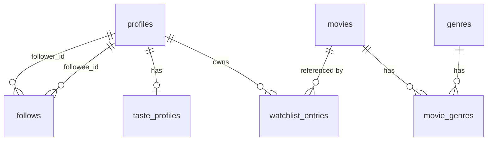

# Watchlist — movie watchlist tracker

Search TMDB, keep a list of films to watch, rate the ones you've seen, see your stats and get an AI read on your taste. Built for the MAC Projects Take-Home Assessment 2026.

**Live:** https://watchlist-ashen-ten.vercel.app · **Author:** Ishaan Kataria · ishaankataria3@gmail.com

**Demo account:** `demo@example.com` / `watchlist-demo`. It has a rated history and follows sam and mira, so Stats, Taste profile, the Feed and their profiles are populated. You can also create your own account: email confirmation is off (see Assumptions).

## Features

- Search TMDB, open a film's page (backdrop, runtime, genres, cast) and add it to your watchlist
- Mark a film watched with a 1–10 rating (or skip the rating), change it later, move it back, or remove it with undo
- Stats computed in SQL: films watched and rated, average rating, total runtime, genre breakdown, rating histogram
- AI taste profile: a short critic's read on your ratings and 3–5 films to watch next, each citing a film you rated
- Friend system: change your handle, find members by name or @handle and follow them. The feed lists the films the people you follow watch and rate, a member's page shows their stats and watched films once you follow them, and posters show which of them watched a film
- Mobile-first: a bottom tab bar under `md`, bottom-sheet drawers instead of dialogs, a 2 to 6 column poster grid, 44px touch targets

## Stack

Next.js 16 (App Router, TypeScript) · Tailwind v4 + shadcn/ui on Base UI · Supabase (Postgres, Auth, RLS) · Zod · Vercel AI SDK 7 + `@ai-sdk/anthropic` · TMDB API · Vitest · Vercel

## Run locally

Needs Node 22.18+ (`pnpm seed` runs TypeScript through Node's type stripping), pnpm and the Supabase CLI. Vercel builds on Node 22.x, set by `engines` in `package.json`.

```bash
pnpm install
cp .env.example .env.local        # fill in the values; each one is described in the file
supabase link --project-ref <ref>
pnpm db:push                      # applies supabase/migrations
pnpm seed                         # creates demo, sam and mira with a rated history (uses the service-role key)
pnpm dev
```

## Architecture

- **Pages** are Server Components that call `services/` directly. Services are the only code that touches tables, always through the member's own Supabase client, so RLS applies to every read and write.
- **Mutations** go from the browser to route handlers under `app/api`. Each one is `route(async (req) => { requireUser(); parse with Zod; call the service; return a status })`, and `route()` maps every failure to `{ error: { code, message } }` with the right status. Route handlers rather than server actions because the contract is plain HTTP (401, 400, 404, 409, 415, 429) that anyone can check with curl.
- **Auth** is Supabase Auth. The browser's Supabase client only signs in and out; it never reads data. `proxy.ts` refreshes the session with `getClaims()` and sends signed-out pages to `/login`. It skips `/api`, which answers 401 JSON itself.
- **Stats** come from one SQL function, `user_stats()`, which runs as the caller so RLS still decides which rows it sees.
- **Cross-member reads** (member search, the feed, member pages, friends who watched) go through `security definer` functions that take handles, act as `auth.uid()`, check the follow graph and return no ids. Every table stays owner-only; `member_stats()` reuses `user_stats()` once the follow check passes.
- **Films** are called live from TMDB for search and film pages. Adding a film snapshots its display fields into `movies` so stats can be computed in SQL.



## Security model

| Requirement                                      | How it's satisfied                                                                                                                                                                                                                                                                                                   | Where                                                                          |
| ------------------------------------------------ | -------------------------------------------------------------------------------------------------------------------------------------------------------------------------------------------------------------------------------------------------------------------------------------------------------------------- | ------------------------------------------------------------------------------ |
| Rows keyed by a stable user id, never an email   | `profiles.id` is `auth.users.id` (a uuid); every member-owned table references it                                                                                                                                                                                                                                    | `supabase/migrations/0001_profiles.sql`                                        |
| Malformed requests and spoofed ids are handled   | The user id only ever comes from the verified session (`requireUser()`); every body and param is Zod-parsed, unknown fields are dropped, and bad input gets a 400                                                                                                                                                    | `lib/http.ts`, `services/watchlist.schema.ts`                                  |
| Sign in and sign out both work                   | Supabase Auth with Google OAuth and email/password; `proxy.ts` refreshes the session; a session whose account was deleted is signed out instead of erroring                                                                                                                                                          | `proxy.ts`, `app/(auth)`, `app/auth`                                           |
| Signed-out API calls return 401                  | `route()` + `requireUser()`; the proxy never redirects `/api/*`                                                                                                                                                                                                                                                      | `lib/http.ts`, `proxy.ts`                                                      |
| Own-row RLS                                      | RLS is on for every table. Members read and write only their own profile and watchlist, and read only their own taste profile; the film cache is read-only                                                                                                                                                           | `0001_profiles.sql`, `0003_movies.sql`, `0004_watchlist.sql`, `0007_taste.sql` |
| Members can't forge server-set columns           | Column grants: members insert only `(user_id, tmdb_id)` and update only `(status, rating)`; timestamps are set by the database                                                                                                                                                                                       | `0005_watchlist_write_columns.sql`                                             |
| Server-only writes                               | Taste profiles and the film cache are written with the service role from a `server-only` module; insert and update are revoked from members, so no one can plant a profile or reset the regenerate limit with the browser's session token                                                                            | `lib/supabase/admin.ts`, `0003_movies.sql`, `0007_taste.sql`                   |
| No internal id reaches the browser               | DTO mappers strip ids: entries are addressed by `tmdbId`, members by `handle`; no uuid appears in any response or page                                                                                                                                                                                               | `services/dto.ts`                                                              |
| CSRF                                             | SameSite=Lax session cookies + JSON-only request bodies (415 otherwise), which a cross-site page can't send without a CORS preflight                                                                                                                                                                                 | `lib/http.ts`                                                                  |
| Follow edges keyed on the stable id              | `follows (follower_id, followee_id)` references `profiles.id` with a composite primary key; handles are resolved to ids inside the database, so a rename keeps every edge                                                                                                                                            | `0008_social.sql`                                                              |
| Follows are idempotent and can't target yourself | `PUT` and `DELETE /api/follows/[handle]` answer 204 however often they run (`on conflict do nothing`, a no-op delete); following yourself is a 400, backed by a check constraint, and an unknown handle a 404                                                                                                        | `0008_social.sql`, `services/social.ts`                                        |
| The follow graph is closed to direct access      | `follows` has RLS on, no policies and no grants for `anon` or `authenticated`, so the Data API refuses it even with a member's session token. Search, list, follow and unfollow are `security definer` functions that take a handle, act as `auth.uid()`, return no ids and are executable by signed-in members only | `0008_social.sql`                                                              |
| You only see data of accounts you follow         | `feed`, `member_watched`, `member_stats` and `friends_who_watched` join on the caller's own follow edges, so a member you don't follow gives zero rows or null, the same as an unknown handle. `member_profile` gives anyone only the header: handle, name, avatar and follow counts                                 | `0009_feed.sql`                                                                |
| To-watch lists stay private                      | Every cross-member function filters `status = 'watched'`; `watchlist_entries` itself stays owner-only under RLS                                                                                                                                                                                                      | `0009_feed.sql`, `0004_watchlist.sql`                                          |
| Cross-member reads need a session                | The feed, member and friends functions are executable by `authenticated` only, so the publishable key without a session is refused; they take handles or TMDB ids and return handles and film data, never ids                                                                                                        | `0009_feed.sql`                                                                |

## Assumptions

- Email confirmation is off so reviewers can sign up with any address (Supabase's built-in mailer only delivers to project members). In production this would use a custom SMTP provider with confirmation on.
- Movies only. The `movies` table is a snapshot of each watchlisted film's display fields, not a mirror of TMDB.
- Adding a film always creates a to-watch entry; status and rating change via PATCH.
- A rating exists only on a watched film; moving a film back to "to watch" clears it.
- Handles are generated at sign-up from the email or Google name (`a–z 0–9 _`, 3–20 characters, a numeric suffix on collision, a short reserved list).
- The taste profile needs at least 3 rated films. An unchanged history returns the saved profile without a model call; a changed history can regenerate at most once a minute.
- Functions are pinned to `syd1` (`vercel.json`), next to the Sydney Supabase region.
- Visibility: you see only the accounts you follow, and of those only watched films with their ratings and watched dates. To-watch lists are private to their owner. Any signed-in member can find another and see their handle, name, avatar and follower and following counts, nothing more, until they follow them.
- The feed shows the watched films of the people you follow, newest first, 30 at a time. Marking a film watched is the event: a later rating change updates the row but doesn't move it, since `watched_at` is the first time the film was marked watched.

## AI taste profile

- Claude Sonnet 5 through the Vercel AI SDK: `generateText` with a Zod output schema. The model id comes from `AI_MODEL`, so swapping models is an env change.
- The prompt holds the 60 most recent ratings plus every title on the list, so recommendations never repeat a listed film. Each suggestion is matched against TMDB by title and year so it links to a real film page; unmatched or already-listed suggestions are dropped.
- The saved profile carries a hash of exactly what the model was sent. If nothing changed, the saved profile comes back with no model call. If the list changed, regenerating is limited to once a minute: the API answers 429 with `Retry-After`, and the page disables Regenerate until then.
- Cost guards: 2000 output tokens per draft, one retry when a draft breaks the schema or matches fewer than 3 films, and a 45-second budget across both.

## Testing

`pnpm check` runs typecheck, lint, the Prettier check and the unit tests; CI runs it on every push and pull request.

**Unit** (`pnpm test`, Vitest) covers the pure logic:

- Request schemas: TMDB ids, rating bounds (0, 11, 7.5 and "ten" are rejected), a spoofed user id dropped, non-canonical id params like `1e3` rejected
- `parseJson` and `parseQuery`: non-JSON content types get a 415, a charset suffix is accepted, a bad query string is a 400
- TMDB client: response mapping, the bearer token, 404 as null, failures as 502
- `user_stats()` parsing, including an empty account
- Taste profile: prompt hashing, recommendation picking, the regenerate countdown
- Handles and the profile update: format, reserved names, a trimmed display name, an empty update rejected, fields members can't set dropped
- Member search input: trimmed, a leading `@` dropped, `@` alone or over 40 characters rejected
- Follow errors: an unknown handle maps to 404, following yourself to 400, anything else to 500
- Feed cursor parsing (a Postgres timestamp passes back verbatim) and the feed, member profile and watched-film mappers

**End to end** (`pnpm e2e`, Playwright) runs on Desktop Chrome and iPhone 14 (WebKit), one test at a time; the security spec is plain HTTP, so it runs on Desktop Chrome only:

```bash
pnpm exec playwright install chromium webkit    # once
pnpm e2e                                        # builds and starts the app on :3000, or reuses one running there
BASE_URL=https://watchlist-ashen-ten.vercel.app pnpm e2e
```

- `BASE_URL` defaults to `http://localhost:3000`. Vercel previews sit behind Deployment Protection, which answers every request with its own 401, so point it at localhost or production.
- It needs `.env.local`: setup creates `e2e_viewer`, `e2e_stranger` and `e2e_friend` with the service-role key. The local app and production share one Supabase project, so the global teardown deletes those accounts and reruns `pnpm seed`, pass or fail.
- `e2e/security.spec.ts` checks the security model over HTTP: every API route answers 401 JSON when signed out, a user id in the body is ignored, malformed ratings, ids and queries get 400 and non-JSON bodies 415, following yourself is 400, following twice is 204 both times, an unknown handle is 404, a member who follows nobody sees no one's watched films, the Data API gives the publishable key nothing, and no page or JSON response contains a UUID.
- `e2e/core.spec.ts`: the demo account signs in, adds a film, marks it watched with a rating, sees Stats count it and removes it.
- `e2e/social.spec.ts`: follow a member from search, find them in the feed and on their page, unfollow; a new handle keeps the people you follow; a feed of exactly 30 rows offers no Load more, and one of 35 loads the last 5 once, with no row repeated.

## Known limitations

- The regenerate limit checks, then acts: parallel requests straight after a list change can each pay for a model call. The page disables the button while one is running.
- Search shows TMDB's first page of results (20 films).
- The watchlist and a member's watched films are not paginated.
- The feed pages by `watched_at` alone, so entries sharing one timestamp across a page edge are skipped past. The app marks one film watched per request; only a bulk SQL update, which stamps every row with its transaction's `now()`, would create such a tie.
- Friends who watched covers the first 500 films of a grid; only a watchlist longer than that could pass it.
- An unknown film or member page shows Not found with a 200 status: its loading skeleton streams before the page knows the film or member doesn't exist.
- Passwords aren't checked against known breaches: Supabase offers that check on paid plans only.

---

This product uses the TMDB API but is not endorsed or certified by TMDB.
